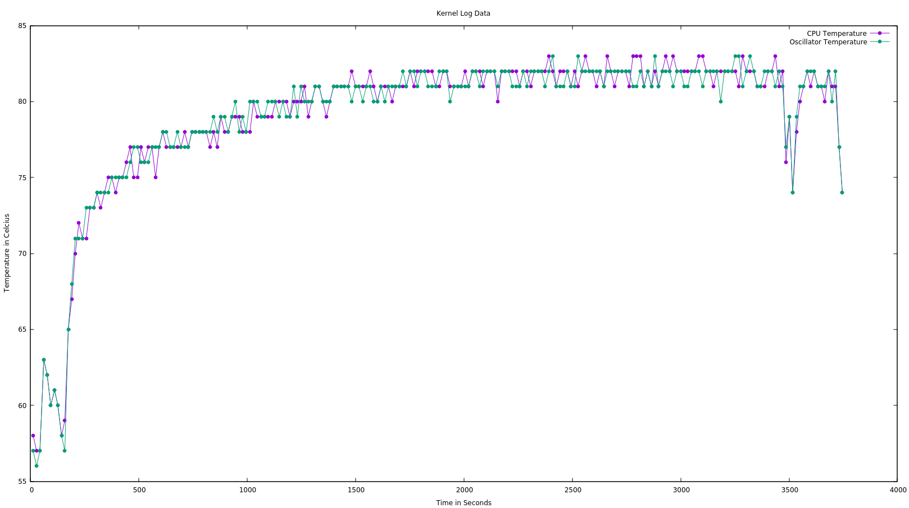
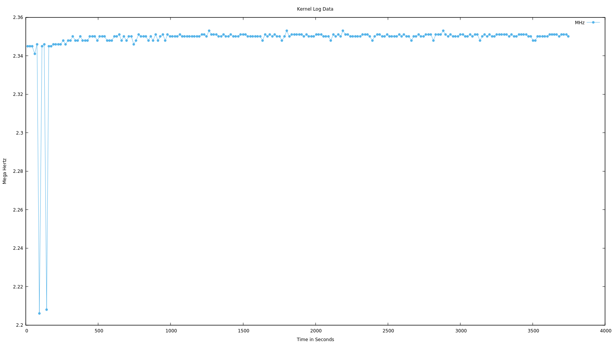
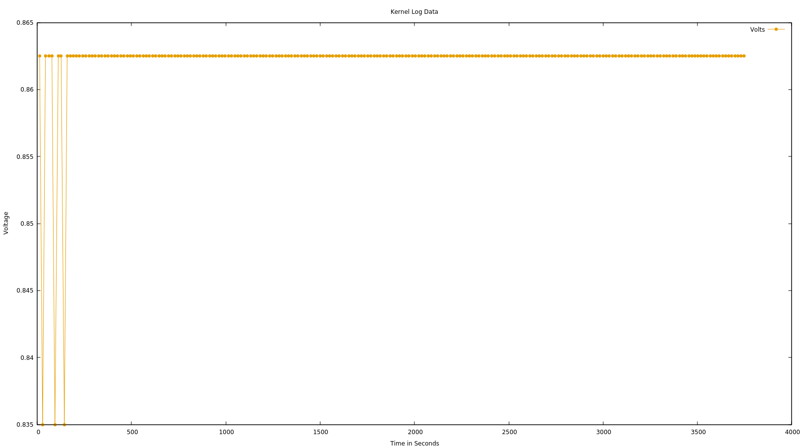

# CPU Temperature Report  

> Visual representation of cpu temperature log stored in "kernel_build_temp_data" file utilising GNUplot during compilation of "build_kernel" script.  

GNUplot Version:  
  - gnuplot 5.2 patchlevel 6  

#### Temperature Graph

Commands:
- gnuplot> set title "Kernel Log Data"  
- gnuplot> set xlabel "Time in Seconds"  
- gnuplot> set ylabel "Temperature in Celcius"  
- gnuplot> plot "kernel_build_temp_data" using 1:2 every 15 title "CPU Temperature" linetype 7 linewidth 0 linecolor 1 with linespoints, "kernel_build_temp_data" using 1:5 every 15 title "Oscillator Temperature" linetype 7 linewidth 0 linecolor 2 with linespoints

During the compilation of the build_kernel script, the temperature of the CPU steadily increased as shown. 
Approximately, 500 seconds into the compilation temperature drasticly changed for almost an hour before steadily decreasing. 
This aligns with the lengthy build time for creating the zImage device tree binaries that were then installed. 
Only after completion did the CPU finally cool.
For comparison, the "ring oscillator" temperature was also recorded, also displaying very similar outputs in temperature. 

The log data created was recorded per second, but for clarity, plot points were limited every 15 seconds to ensure better visability of log data.

Finally, for comparison to the high-output of temperature data, I checked voltage and hertz of the ring oscillator to see if there were any notable
changes to reflect the stress on the Raspberry Pi, however aside from the sporadic start, both maintained a stability throughout the build_kernel process.

#### Hertz Graph

Commands:
- gnuplot> set title "Kernel Log Data"
- gnuplot> set xlabel "Time in Seconds"
- gnuplot> set ylabel "Mega Hertz"
- gnuplot> plot "kernel_build_temp_data" using 1:3 every 15 title "MHz" linetype 7 linewidth 0 linecolor 3 with linespoints

#### Voltage Graph

Commands:
- gnuplot> set title "Kernel Log Data"
- gnuplot> set xlabel "Time in Seconds"
- gnuplot> set ylabel "Voltage"
- gnuplot> "kernel_build_temp_data" using 1:4 every 15 title "Volts" linetype 7 linewidth 0 linecolor 4 with linespoints

