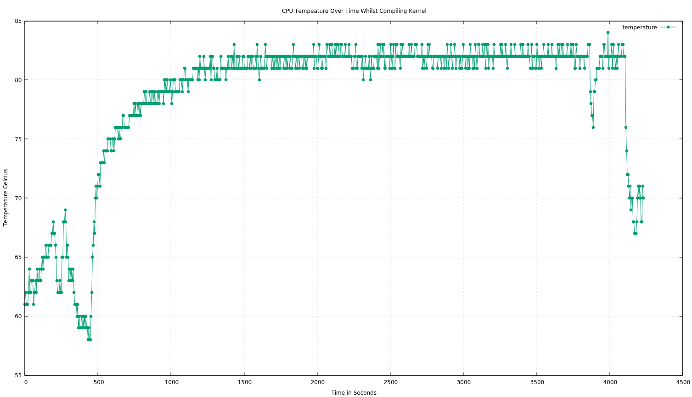

# CPU Temperature Report

> Visual representation of cpu temperature log stored in "kernel_build_temp_data" file utilising GNUplot during compilation of "build_kernel" script.

GNUplot Version:
  - gnuplot 5.2 patchlevel 6

#### CPU Temperature Image
[]
Commands:
- gnuplot> set title "CPU Temp"
- gnuplot> set xlabel "Time in Seconds"
- gnuplot> set ylabel "CPU Temp in Celcius"
- gnuplot> "kernel_build_temp_data" using 1:2 title "temp" linetype 7 linecolor 2 with linespoints

During the compilation of the build_kernel script, the temperature of the CPU steadily increased as shown. Approximately, 500 seconds into the compilation temperature drasticly changed for almost an hour before steadily decreasing. This aligns with the lengthy build time for creating the zImage device tree binaries that were then installed. Only after completion did the CPU finally cool.